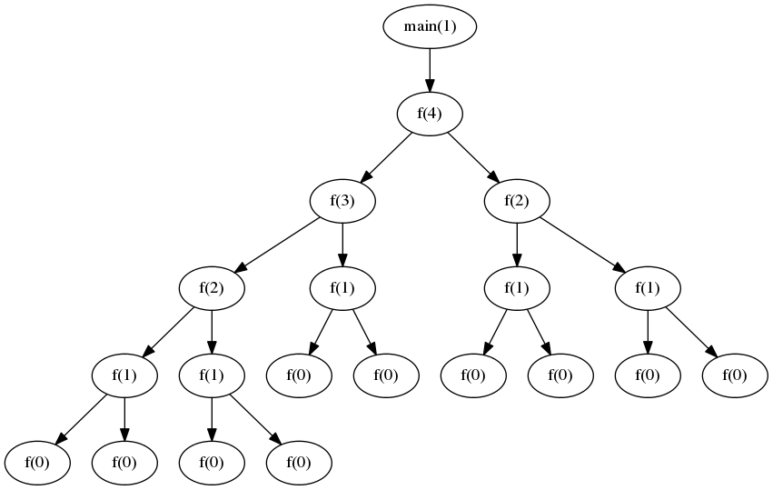

% Quiz 2: 1/21/15

# Question 1
**2pts.** What is the interface between the user and the kernel called? **System Calls or Shell**

# Question 2
**3pts.** What are the two types of memory? **Stack, Heap (half credit for listing Text, BSD, or Data)** 

# Question 3
Use the program below:

~~~c
int f(int n)
{
	if(n <= 0)
		return n;
	else
		return f(n-1) + f(n/2);
}

int main()
{
	int value = f(4);
	printf("Value = %d\n", value);
	return 0;
}
~~~

 a) **3pts.** Draw the callgraph from of this program. **See Below**
 b) **2pts.** How many stack frames are required for this program to run? **6 including Main**

