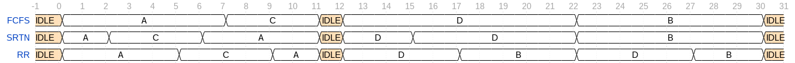

**Quiz 17: 3/10/15**

# Question 1
| Process | Arive Time | Process Time |
|---------|------------|--------------|
| A       | 0          | 7            |
| B       | 15         | 8            |
| C       | 2          | 4            |
| D       | 12         | 10           |

Draw the schedule timeline for the above processes and give the average response time (the average time between a process arriving and finishing) using the following scheduling algorithems:

a) First Come First Serve (FCFS)
b) Shortest Remaining Time Next (SRTN)
c) Round Robin (RR) w/ quantum = 5 units.

**Answer:**

Average response time: 

a) FCFS: 41/4 = 10.25
b) SRTN: 40/4 = 10
c) RR: 48/4 = 12

