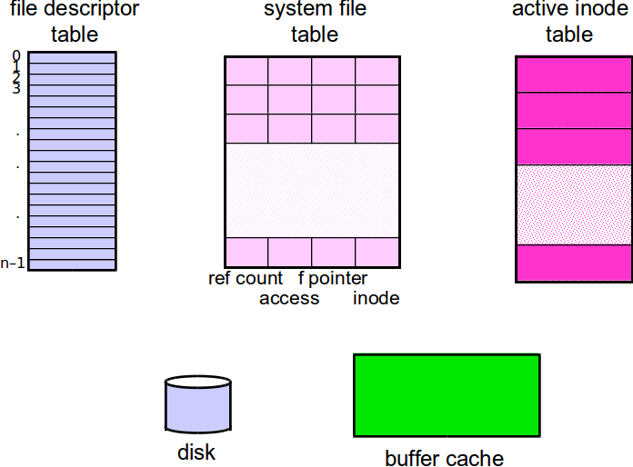

**Quiz 21: 4/6/15**

The following program is run.  What will be the in each slot of the `file descriptor table`, `system file table`, and `active inode table` when the code reaches the `do_stuff()` line?  Please draw the arrows between each table showing which pointers point that what.

~~~C
int main(int argc, char** argv){
	int fd1, fd2, fd3, fd4;
	fd1 = open("file1", O_RDONLY);
	fd2 = open("file1", O_RDWR);
	fd3 = open("file2", O_WRONLY);
	fd4 = dup(fd2);
	dup2(1, fd3);
	
	do_stuff();
	return 0;
}
~~~

Prototypes:

~~~C
int open(const char *pathname, int flags);
int dup(int oldfd);
int dup2(int oldfd, int newfd);
~~~

